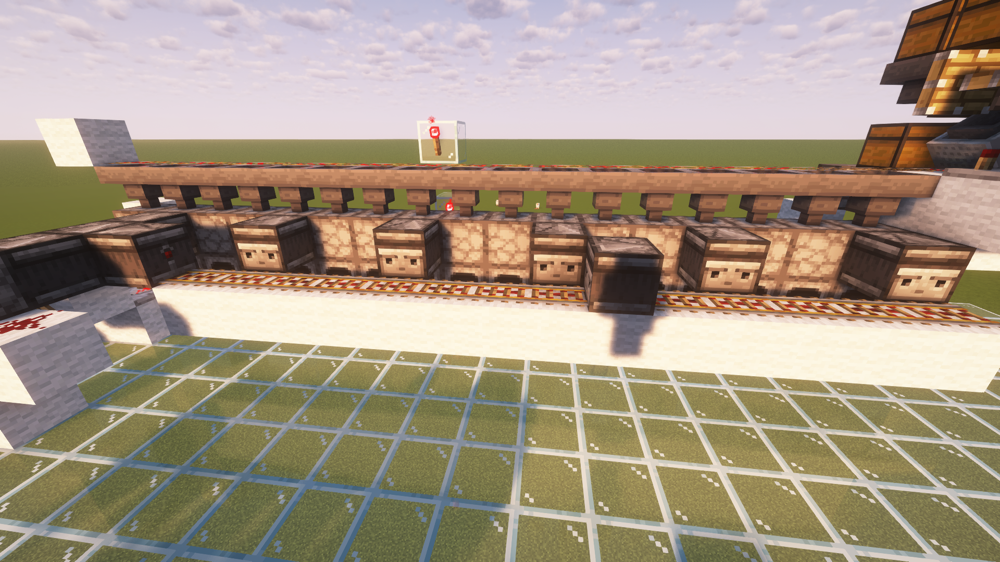
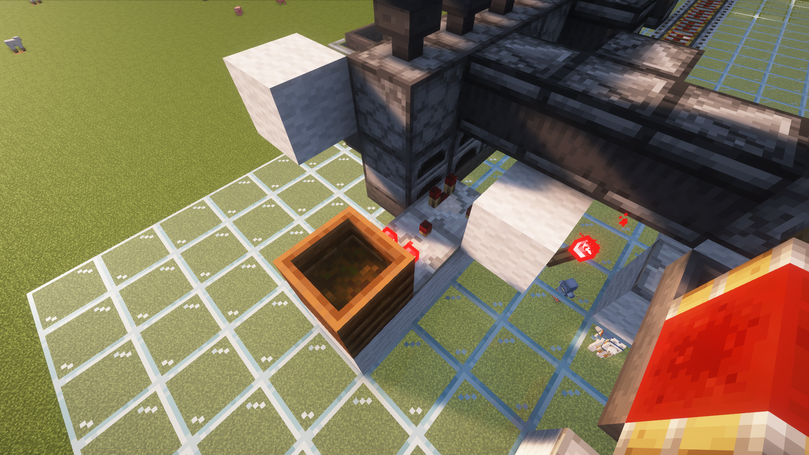
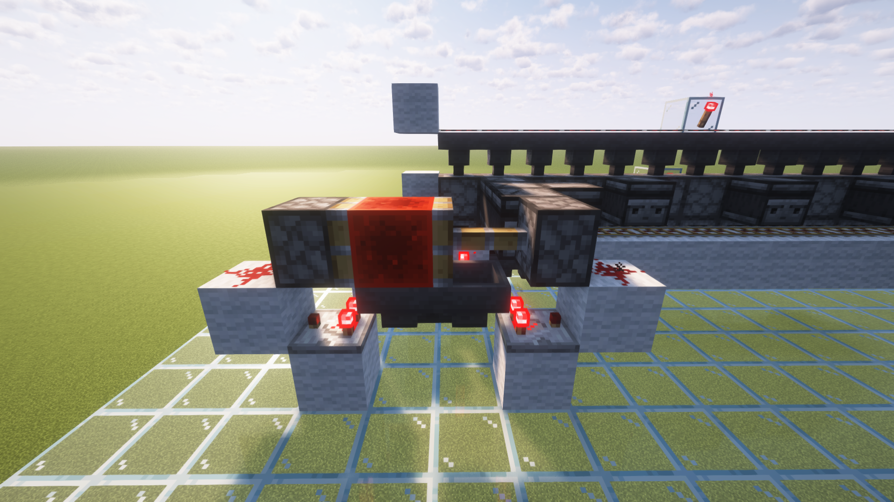

### Smart Super Duper Smelter

Creative name I know :)

## Problem
A couple of years ago, I had the great idea of connecting a bamboo farm to an super smelter array so I never had to think about fuel anymore. However, it had one major flaw: when the bamboo was depleted with items in the furnace, all future bamboo would be wasted. More precisely, with large smelting jobs, the furnace array would deplete all of its fuel but still have items to smelt, and because it takes 4 bamboo to smelt one item, when another bamboo was distributed to the furnace array, it would be burned before another bamboo could be inputted and more critically before the item could be smelted. 

### Attempts
There was a number of solutions I tried to patch the problem
- Creating a buffer between the bamboo farm and the smelter
- Increasing fuel distribution rates
- Increasing the relative capacity of the bamboo farm and the furnace

### Controlling input
It wasn't until I learn about digital logic and the concept of program state (or in this case machine state) that I came up with a more robust solution 

### Elements of the solution
Raw items are loaded into a intermediate dropper (places one item into the hopper upon a redstone signal)  

The "control" furnace, the furnace that receives the fuel last, fuel amount is read  

  

When the control furnace's fuel is high enough, the clock begins. 

  

The clock cycles the amount of time it takes to smelt a item, and triggers the droppers to input an item. I toyed around with a locked hopper, but it would just dump their items into the load hopper which might overwhelm the system. 

### Additional Elements  
Only allow full chests of fuel to be distributed (this makes the fuel distributions somewhat equal)  

