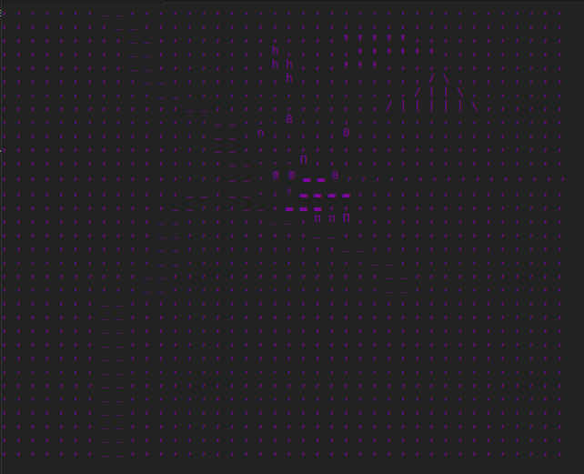

# Unknown

### Entities 

#### Character
Representation: 8
Objective: Give the player the means to interact with the world, form groups, influence villages, and collect resources

#### Animal Herd  
Representation: H  
Objective: To create a natural animal herd that will provide the basis of food and organic goods for many nomadic settlements

##### Properties:
- A set of Animals (Object)
- Resources: Food, skins, experience
- Wander throughout the world

#### NPCs 
Representation: 0 or o
###### Properties:
- Leader ( Resource weight setter )
- Protector ( Defense against foreign colonies )
- Worker (Farming, housing, builder)
- Explorer / trader 
    - Algorithm: Swarm intelligence

villages - ⟰ ⇑ п П

### Background
Each character represents a 1 x 1 km area  

#### Water 
Representation: _
###### Properties:
- Community cannot cross without a boat / raft
- Can fish with a fishing line or net
- Resources: Food, water
 
#### Cliffs / Mountain
Representation: | / \
###### Properties: 
- Cannot cross without ropes   
- You can see further on a mountain
- Resources: Safety

#### Plains
Ground: ,  
Properties: 

#### Forest 
Representation: ↟
Properties: 
- Wood

#### Farmland
Representation: ▂
Properties:
- Only work in the Spring - Fall
- Resources: Food

#### Example  
